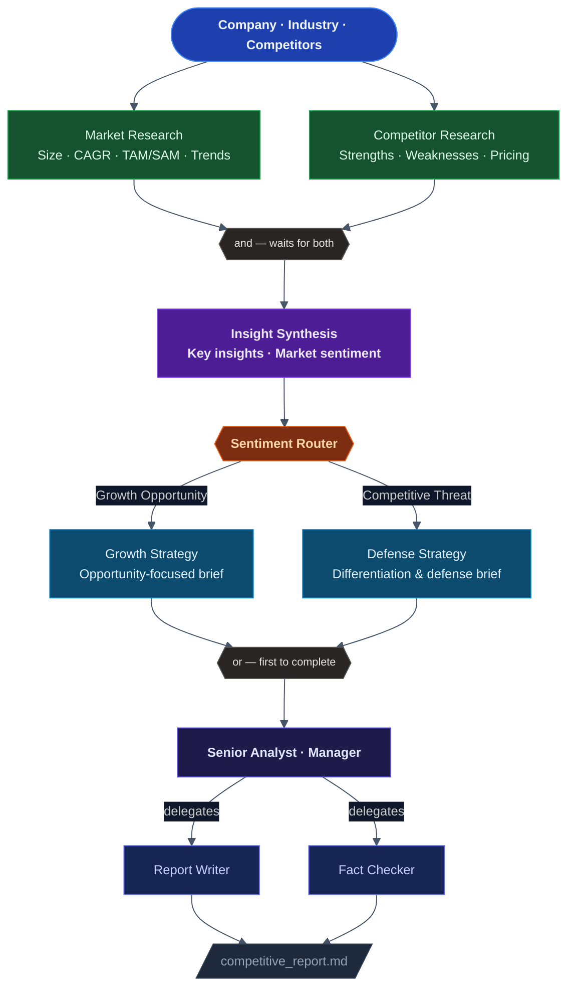

# AI-Powered Competitive Intelligence System

## About the Project

Competitive intelligence is one of the most valuable — and most time-consuming — activities in any product or strategy team. Understanding where the market is heading, what competitors are doing, and what your company should do about it requires pulling together data from dozens of sources, synthesizing conflicting signals, and translating it all into actionable recommendations. Done manually, a thorough competitive report takes a full day or more, involves multiple people, and goes stale within weeks.

This project replaces that manual workflow with an **AI-powered multi-agent system** built on **CrewAI**. It operates like a small, specialized research team: agents work in parallel, hand off outputs to the next stage, adapt their strategy based on what the data actually says, and produce a consistent, structured report every time — in minutes.

### What it does

Given three inputs — a company name, a target industry, and a list of competitors — the system:

- Researches the market landscape using live web search: size, growth rate, CAGR, key trends, and TAM/SAM estimates
- Profiles each competitor individually: strengths, weaknesses, pricing model, and market positioning
- Synthesizes both research streams into key strategic insights and classifies the market sentiment
- Routes execution based on that sentiment — growth markets get an opportunity-focused strategy; competitive markets get a defense and differentiation strategy
- Passes the draft through a hierarchical review team that rewrites, fact-checks, and validates the report
- Saves a structured 6-section intelligence report to markdown

### Who it is for

- **Strategy and product teams** who need recurring competitive intelligence without the manual effort
- **AI engineers** looking for a reference implementation of a production-style multi-agent system
- **CrewAI practitioners** wanting to see every major framework concept — flows, parallel crews, routing, hierarchical process, guardrails, and Pydantic output — working together in a single cohesive project

### Why it matters

Most AI demos show a single agent answering a question. Real-world AI systems require orchestration — multiple agents with different specializations, working in the right order, with the right data, producing output that can be trusted. This project is built to that standard: parallel execution, conditional branching, quality guardrails with retries, and validated structured output. It is designed to be dropped into any industry by changing three lines in `main.py`.

---

## Architecture

The system is orchestrated by a **CrewAI Flow** — a stateful pipeline that connects specialized agent crews through a directed graph. Each node in the graph is a discrete unit of work, and the flow manages execution order, parallelism, and conditional branching automatically.



### Stage 1 — Parallel Research

As soon as the flow starts, two crews are launched simultaneously — no waiting for one to finish before the other begins.

The **Market Research Crew** searches the web for industry-level data: total addressable market, serviceable addressable market, compound annual growth rate, key industry trends, and emerging threats. It focuses on the big picture — where the market is, where it is going, and how fast.

The **Competitor Research Crew** searches for intelligence on each named competitor: their product positioning, notable strengths, known weaknesses, pricing model, and where they sit in the competitive landscape. Each competitor is profiled individually so the final report can speak to them specifically.

Both crews use live web search via SerperDev, so the output reflects current data rather than the model's training knowledge.

### Stage 2 — Synthesis

Once both research streams are complete, an agent reads both reports together and produces two things: a set of **key strategic insights** that connect the market data to the competitor landscape, and a **market sentiment** classification — either `growth_opportunity` (the market is expanding, competition is manageable) or `competitive_threat` (the market is crowded or contracting, differentiation is urgent).

This synthesis step exists because the two research crews produce raw findings. The synthesis agent's job is to connect them — to notice, for example, that a fast-growing market combined with a fragmented competitor set represents a specific kind of opportunity that should drive the strategy.

### Stage 3 — Conditional Routing

The market sentiment from the synthesis step determines which kind of strategy report gets written.

A **growth opportunity** triggers an opportunity-focused brief: where to expand, which customer segments to target, how to capture share while the market is still forming.

A **competitive threat** triggers a defense and differentiation brief: how to protect existing position, where to sharpen the product, which competitor moves to watch closely.

Both paths use the same Strategy Crew, but the framing, tone, and recommendations differ based on what the market actually calls for. This prevents the system from producing generic advice — the strategy is shaped by the evidence.

### Stage 4 — Hierarchical Review

The strategy draft enters a **three-agent review crew** running in hierarchical mode. A Senior Analyst acts as manager: it reads the draft, decides what needs to be done, and delegates specific tasks to two specialists — a Report Writer who restructures and polishes the content, and a Fact Checker who validates claims against the source research.

The manager does not write the report itself. It directs the work, reviews the specialists' output, and decides when the report meets the standard. This mirrors how a real editorial team operates.

A **guardrail** enforces a completeness check before any output is accepted: all six required sections must be present, strategic insights must number at least five, and risk factors must number at least three. If the output falls short, the crew is asked to retry — up to three times — before the pipeline fails. This prevents partial or thin reports from being saved as final output.

### Stage 5 — Structured Output

The validated report is saved as both a Pydantic model (guaranteeing structural consistency) and a markdown file at `reports/competitive_report.md`. Every run produces the same six sections in the same structure, regardless of which branch the router took or how the agents chose to phrase things.

---

## Project Layout

```
7_competitive_intel/
├── pyproject.toml
├── .env
├── reports/                              ← output report (created at runtime)
├── flow_visualization/                   ← interactive flow diagram (created at runtime)
└── src/
    └── competitive_intel/
        ├── __init__.py
        ├── main.py                       ← entry point + flow.plot()
        ├── flow.py                       ← IntelligenceFlow (all decorators)
        ├── models.py                     ← Pydantic state and output models
        ├── config/
        │   ├── agents.yaml               ← 6 agent definitions
        │   └── tasks.yaml                ← 4 task definitions
        └── crews/
            ├── market_crew.py            ← MarketResearchCrew
            ├── competitor_crew.py        ← CompetitorResearchCrew
            ├── strategy_crew.py          ← StrategyCrew
            └── review_crew.py            ← ReviewCrew (hierarchical + guardrail)
```

---

## Setup

**Prerequisites:** Python >= 3.10, < 3.14 and [uv](https://docs.astral.sh/uv/).

```powershell
uv venv
uv pip install -e .
```

Create `.env` in the project root:

```
OPENAI_API_KEY=sk-...
SERPER_API_KEY=...
MODEL=gpt-4o-mini
```

---

## Running

```powershell
uv run competitive_intel
```

To analyze a different company, edit `main.py`:

```python
company = "Notion"
industry = "Productivity Software"
competitors = ["Obsidian", "Confluence", "Coda", "Roam Research"]
```

---

## Outputs

| File | Description |
|---|---|
| `reports/competitive_report.md` | Final structured intelligence report |
| `flow_visualization/flow_visualization.html` | Interactive flow diagram — open in browser |

### Report sections

1. **Executive Summary** — overview of findings and strategic direction
2. **Market Overview** — market size, growth rate (CAGR), key trends, TAM/SAM estimate
3. **Competitor Profiles** — strengths, weaknesses, pricing, and market position per competitor
4. **Strategic Insights** — minimum 5 distinct, actionable insights
5. **Risk Factors** — minimum 3 specific risks with mitigation context
6. **Recommendations** — concrete next steps prioritized by impact
